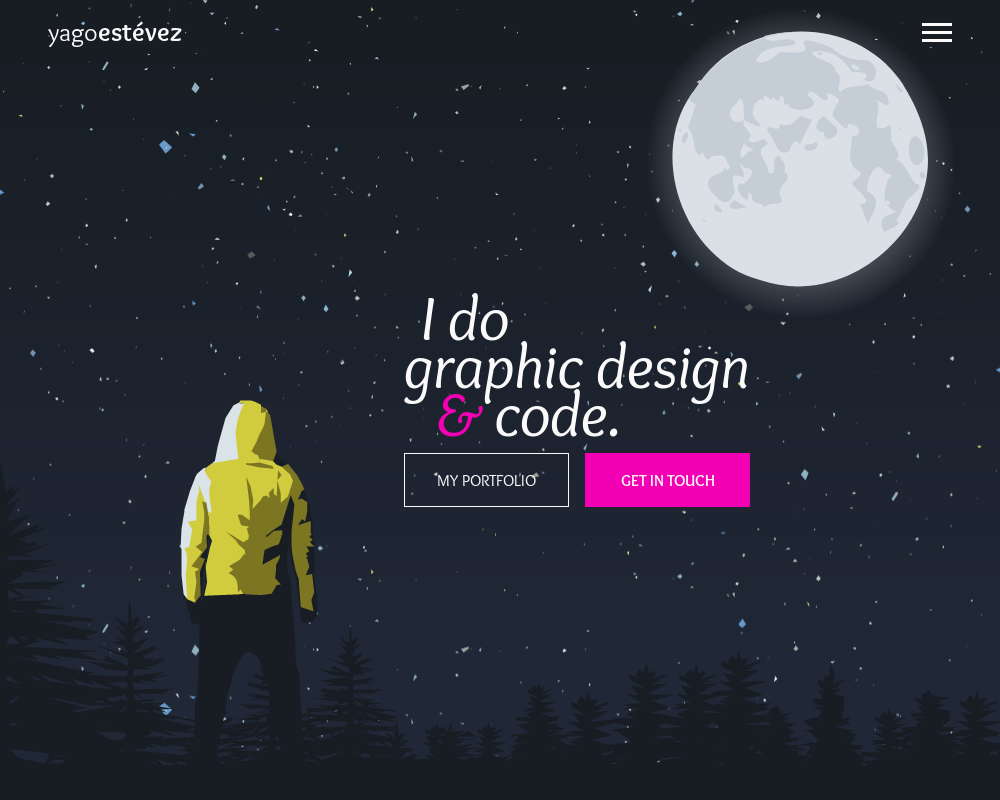

# My Portfolio
#### Project made for the "Responsive Web Design" module in freeCodeCamp
---

A portfolio showing most of the projects I made to get the Full-Stack Developer certificate at freeCodeCamp.

#### Screenshot



#### Try it out!

If you want to see it live, open [this pen](https://codepen.io/yagoestevez/full/oapQEJ) on Codepen.

#### User Stories

These are the requirements for this project. They are all fullfilled.

1. My portfolio should have a welcome section with an id of ```welcome-section```.
2. The welcome section should have an ```h1``` element that contains text.
3. My portfolio should have a projects section with an id of ```projects```.
4. The projects section should contain at least one element with a class of ```project-tile``` to hold a project.
5. The projects section should contain at least one link to a project.
6. My portfolio should have a navbar with an id of ```navbar```.
7. The navbar should contain at least one link that I can click on to navigate to different sections of the page.
8. My portfolio should have a link with an id of ```profile-link```, which opens my GitHub or FCC profile in a new tab.
9. My portfolio should have at least one media query.
10. The height of the welcome section should be equal to the height of the viewport.
11. The navbar should always be at the top of the viewport.


---

[Yago Estévez](https://twitter.com/yagoestevez)
